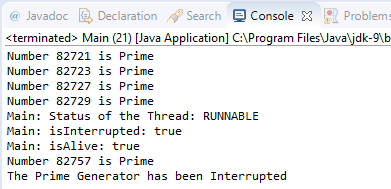

실행 스레드가 둘 이상인 Java 프로그램은 모든 스레드의 실행이 종료 될 때 (특히 비데몬 스레드가 모두 실행을 종료하거나 스레드 중 하나가 `System.exit()`메소드를 사용하는 경우 ) 프로그램이 종료됩니다. 때로는 프로그램을 종료하려고 하거나 프로그램 사용자가 스레드가 수행중인 태스크를 취소하려고 할 때 스레드를 완료해야 할 수도 있습니다.

Java는 종료하려는 스레드를 나타내는 중단 메커니즘을 제공합니다. 이 메커니즘의 특징 중 하나는 스레드 객체가 중단되었는지 여부를 확인해야 하며 최종 요청에 응답할지 여부를 결정할 수 있다는 것입니다. 스레드 객체는 이를 무시하고 계속 실행할 수 있습니다.

이 레시피에서는 중단 메커니즘을 사용하여 스레드를 작성하고 5초 후에 종료를 강제하는 프로그램을 개발합니다.

# **준비하기**

이 레시피에 대한 예제는 Eclipse IDE를 사용하여 구현되었습니다. Eclipse 또는 NetBeans와 같은 다른 IDE를 사용하는 경우 Eclipse를 열고 새 Java 프로젝트를 작성하십시오.

# **그것을 하는 방법 ...**

예제를 구현하려면 다음 단계를 수행하십시오.

### 1. 클래스 `Thread`를 확장하는 `PrimeGenerator`클래스를 작성하십시오 .

```java
public class PrimeGenerator extends Thread{
```

### 2. 무한루프를 포함 하여 `run()`메소드를 오버라이드하세요. 이 루프에서는 1부터 시작하여 연속 번호를 처리합니다. 각 숫자에 대해 소수인지 계산하십시오. 소수라면 콘솔에 출력하세요.

```java
@Override 
public void run() { 
  long number=1L; 
  while (true) { 
    if (isPrime(number)) { 
      System.out.printf("Number %d is Prime\n",number); 
    }
```

### 3. 숫자를 처리 한 후 `isInterrupted()`메소드를 호출하여 스레드가 중단되었는지 확인하십시오 . 이 메소드가 `true`를 반환하면 스레드가 중단 된 것입니다. 이 경우 콘솔에 메시지를 출력하고 스레드 실행을 종료합니다.

```java
    if (isInterrupted()) { 
      System.out.printf("The Prime Generator has been
                         Interrupted"); 
      return; 
    } 
    number++; 
  } 
}
```

### 4.`isPrime()`메소드를 구현하십시오 . 이 장의 ***스레드*** 레시피 ***작성, 실행 및 설정 정보*** 에서 코드를 얻을 수 있습니다 .

### 5. 이제 클래스 `Main`와 `main()`메소드를 구현하여 예제의 기본 클래스를 구현하십시오 .

```java
public class Main { 
  public static void main(String[] args) {
```

### 6. `PrimeGenerator`클래스의 오브젝트를 작성하고 시작하십시오 .

```java
Thread task = new PrimeGenerator(); 
task.start();
```

### 7. 5초 동안 기다렸다가 `PrimeGenerator`스레드를 중단하십시오 .

```java
try { 
  Thread.sleep(5000); 
} catch (InterruptedException e) { 
  e.printStackTrace(); 
} 
task.interrupt();
```

### 8. 그런 다음 중단된 스레드의 상태와 관련된 정보를 작성하십시오. 이 코드 조각의 출력은 스레드가 실행 전후에 스레드를 종료하는지 여부에 따라 다릅니다.

```java
  System.out.printf("Main: Status of the Thread: %s\n",
                    task.getState()); 
  System.out.printf("Main: isInterrupted: %s\n",
                    task.isInterrupted()); 
  System.out.printf("Main: isAlive: %s\n", task.isAlive()); 
}
```

### 9. 예제를 실행하고 결과를보십시오.

# **작동 원리 ...**

다음 스크린 샷은 이전 예제의 실행 결과를 보여줍니다. `PrimeGenerator`스레드가 메시지를 쓰고 중단된 것을 감지하면 실행을 종료 하는 방법을 볼 수 있습니다 . 다음 스크린 샷을 참조하십시오.



이 `Thread`클래스에는 스레드 중단 여부를 나타내는 `boolean`값 을 저장하는 속성이 있습니다 . 스레드의 `interrupt()`메소드를 호출 할 때 해당 속성을 `true`로 설정합니다. 이 `isInterrupted()`메소드는 해당 속성의 값만 리턴합니다.

이 `main()`메소드는 인터럽트된 스레드의 상태에 대한 정보를 작성합니다. 이 경우 스레드 실행이 완료되기 전에 이 코드가 실행되므로 상태는 `RUNNABLE`이고 `isInterrupted()`메서드의 반환 값은 `true`이며 `isAlive()`메서드의 반환 값 `true`도 있습니다. 중단된 경우 `Thread`완료 코드 블록 (당신은, 예를 들어, 초 메인 스레드을 잘 수)의 실행 이전의 실행은 방법 `isInterrupted()`및 `isAlive()`반환하며 `false`값입니다.

# **더 있다...**

이 `Thread`클래스에는 스레드가 중단되었는지 여부를 확인하는 다른 방법이 있습니다. `interrupted()`현재 스레드가 중단되었는지 여부를 확인 하는 정적 메소드 입니다.

# 노트

`isInterrupted()`와 `interrupted()`방법 간에 중요한 차이점이 있습니다. 첫 번째 속성은 중단 된 속성의 값을 변경하지 않지만 두 번째 속성은로 설정합니다 `false`.

앞에서 언급했듯이 스레드 객체는 중단을 무시할 수 있지만 예상되는 동작은 아닙니다.