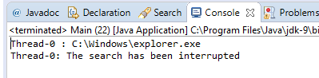

# 스레드 중단 제어(Controlling the interruption of a thread)

이전 레시피에서는 스레드 실행을 인터럽트하는 방법과 스레드 오브젝트에서 이 인터럽트를 제어하기 위해 수행해야 하는 작업을 학습했습니다. 중단 할 수 있는 스레드가 단순하면 이전 예제에 표시된 메커니즘을 사용할 수 있습니다. 그러나 스레드가 복잡한 알고리즘으로 일부 메서드로 나눈 경우 또는 재귀 호출이 있는 메서드가 있는 경우 스레드 중단을 제어하기 위해 더 나은 메커니즘을 사용해야합니다. Java는 이 목적에 대한 `InterruptedException` 예외를 제공합니다 . 스레드 중단을 감지하고 `run()`메소드에서 이를 발견하면 이 예외를 처리 할 수 있습니다 .

이 레시피에서는 폴더와 모든 하위 폴더에서 결정된 이름의 파일을 찾는 태스크를 구현합니다. 이것은 `InterruptedException`예외를 사용하여 스레드 중단을 제어하는 방법을 보여주기 위한 것 입니다.

# **준비하기**

이 레시피에 대한 예제는 Eclipse IDE를 사용하여 구현되었습니다. Eclipse 또는 NetBeans와 같은 다른 IDE를 사용하는 경우 Eclipse를 열고 새 Java 프로젝트를 작성하십시오.

# **하는 방법 ...**

예제를 구현하려면 다음 단계를 수행하십시오.

### 1. `FileSearch`클래스를 작성하고 `Runnable`인터페이스를 구현하도록 지정하십시오 .

```java
public class FileSearch implements Runnable {
```

### 2. 두 개의 private 속성을 선언하십시오. 하나는 검색할 파일 이름과 하나는 초기경로입니다. 다음과 같은 속성을 초기화하는 클래스 생성자를 구현하십시오.

```java
private String initPath; 
private String fileName; 
public FileSearch(String initPath, String fileName) { 
  this.initPath = initPath; 
  this.fileName = fileName; 
}
```

### 3. 클래스의 `run()`메소드를 구현하십시오. `fileName` 속성이 디렉토리인지 확인합니다 . 그렇다면 `directoryProcess()`메서드를 호출합니다 . 이 메소드는 `InterruptedException`예외를 던질 수 있으므로 예외를 잡아야 합니다.

```java
@Override 
public void run() { 
  File file = new File(initPath); 
  if (file.isDirectory()) { 
    try { 
      directoryProcess(file); 
    } catch (InterruptedException e) { 
      System.out.printf("%s: The search has been interrupted",
                        Thread.currentThread().getName()); 
    } 
  } 
}
```

### 4. `directoryProcess()`함수를 구현하십시오. 이 함수는 폴더에 있는 파일과 하위 폴더를 가져 와서 처리합니다. 각 디렉토리에 대해 메소드는 디렉토리를 매개 변수로 전달하여 재귀 호출을 작성합니다. 각 파일에 대해 `fileProcess()`메소드를 호출합니다. 모든 파일과 폴더를 처리 한 후 이 메소드는 스레드가 중단되었는 지 여부를 확인합니다. 그렇다면 이 경우와 같이 `InterruptedException`예외가 발생합니다.

```java
private void directoryProcess(File file) throws
                          InterruptedException { 
  File list[] = file.listFiles(); 
  if (list != null) { 
    for (int i = 0; i < list.length; i++) { 
      if (list[i].isDirectory()) { 
        directoryProcess(list[i]); 
      } else { 
        fileProcess(list[i]); 
      } 
    } 
  } 
  if (Thread.interrupted()) { 
    throw new InterruptedException(); 
  } 
}
```

### 5. `fileProcess()`함수을 구현하십시오 . 이 함수는 처리중인 파일 이름과 검색중인 이름을 비교합니다. 이름이 같으면 콘솔에 메시지를 작성합니다. 이 비교 후에 스레드는 중단되었는 지 여부를 확인합니다. 그렇다면  `InterruptedException`예외가 발생합니다.

```java
private void fileProcess(File file) throws 
                            InterruptedException { 
  if (file.getName().equals(fileName)) { 
    System.out.printf("%s : %s\n",
                      Thread.currentThread().getName(),
                      file.getAbsolutePath()); 
  } 
  if (Thread.interrupted()) { 
    throw new InterruptedException(); 
  } 
}
```

### 6. 이제 예제의 메인 클래스를 구현해 봅시다. `main()`메소드가 포함된 `Main`클래스를 구현하십시오

```java
public class Main { 
  public static void main(String[] args) {
```

### 7. `FileSearch`클래스와 스레드의 객체를 생성하고 초기화하여 작업을 실행합니다. 그런 다음 스레드 실행을 시작하십시오. Windows 운영 체제 경로를 사용했습니다. Linux 또는 iOS와 같은 다른 운영 체제를 사용하는 경우 운영 체제에 존재하는 경로로 경로를 변경하십시오.

```java
FileSearch searcher = new FileSearch("C:\\Windows",
                                     "explorer.exe");
Thread thread = new Thread(searcher); 
thread.start();
```

### 8. 10초 동안 기다렸다가 스레드를 중단하십시오.

```java
  try { 
    TimeUnit.SECONDS.sleep(10); 
  } catch (InterruptedException e) { 
    e.printStackTrace(); 
  } 
  thread.interrupt(); 
}
```

### 9. 예제를 실행하고 결과를보십시오.

# **작동 원리 ...**

다음 스크린 샷은 이 예제의 실행 결과를 보여줍니다. `FileSearch`객체가 중단되었음을 감지하면 객체의 실행이 어떻게 종료 되는지 확인할 수 있습니다 .




이 예제에서는 Java 예외를 사용하여 스레드 중단을 제어합니다. 예제를 실행하면 프로그램에 파일이 있는지 여부를 확인하여 폴더를 통과하기 시작합니다. 예를 들어, `\b\c\d`폴더에 입력하면 프로그램은 `directoryProcess()`메소드에 대한 재귀 호출을 세 번 수행합니다 . 중단된 것을 감지하면 재귀 호출 횟수에 관계없이 `InterruptedException`예외가 발생하고 `run()`메소드에서 실행을 계속합니다 .

# **더있다...**

`InterruptedException`예외는 같은 동시성 API에 관련된 일부 Java `sleep()`메소드에 의해 슬로우됩니다. 이 경우 스레드가 휴면 상태 일 때 (`interrupt()` 메소드로) 스레드가 중단되면 이 예외가 발생합니다 .