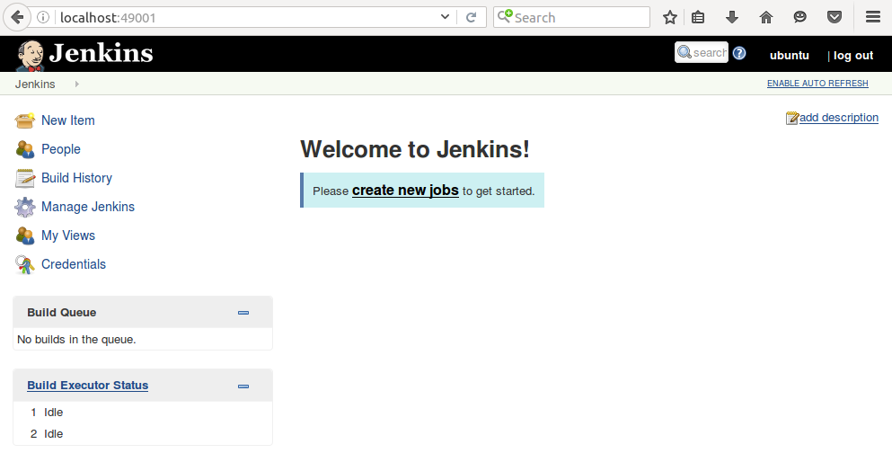

# Jenkins 설치

Jenkins 설치 프로세스는 빠릅니다.간단합니다. 이를 수행하는 방법에는 여러 가지가 있지만 이미 Docker 도구와 그 이점에 대해 잘 알고 있으므로 Docker 기반 솔루션부터 시작하겠습니다. 이것은 또한 가장 쉽고 가장 예측 가능하며 가장 현명한 방법입니다.

이 도커 기반 설치는이 두 가지를 주요 장점 :

* 장애 복구 : Jenkins가 충돌하면 지정된 동일한 볼륨으로 새 컨테이너를 실행하는 것으로 충분합니다.
* 사용자 지정 이미지 : 필요에 따라 Jenkins를 구성하고 Jenkins 이미지로 저장할 수 있습니다. 그런 다음 조직 또는 팀 내에서 공유 할 수 있으며 동일한 구성 단계를 항상 여러 번 반복 할 필요가 없습니다.

설치 프로세스를 시작하기 전에 요구 사항을 살펴 보겠습니다.

## 설치 요구 사항

Jenkins를 설치하기 전에 시스템 을 살펴 봐야 합니다.원활하게 작동하는지 확인해야합니다. 최소 시스템 요구 사항은 상대적으로 낮습니다.

* 자바 8
* 256MB 여유 메모리
* 1GB 이상의 여유 디스크 공간

그러나 요구 사항은 Jenkins로 수행 할 계획에 따라 엄격하게 달라진다는 것을 이해하는 것이 중요합니다. Jenkins를 사용하여 전체 팀을 지속적 통합 서버로 제공하는 경우 소규모 팀의 경우에도 최소 1GB의 여유 메모리와 최소 50GB의 여유 디스크 공간이 있어야합니다. 말할 필요도없이 Jenkins는 일부 계산을 수행하고 네트워크를 통해 많은 데이터를 전송하므로 CPU와 대역폭이 중요합니다.

```
노트
대기업의 경우 요구 사항이 무엇인지 파악하기 위해 Jenkins 아키텍처 섹션 에 Netflix 예제가 나와 있습니다.
```

## Docker에 Jenkins 설치

이제 이해 했으니 요구 사항, Docker를 사용하여 Jenkins를 설치하겠습니다.

Jenkins 이미지를 사용할 수 있습니다. Docker Hub 레지스트리에 있으므로 설치하려면 다음 명령을 실행해야합니다.

```bash
$ docker run -p <host_port>:8080 -v <host_volume>:/var/jenkins_home jenkins/jenkins:2.150.3
```

다음 매개 변수를 지정해야합니다.


* 첫 번째 host_port매개 변수 : 컨테이너 외부에서 Jenkins가 표시되는 포트입니다.
* 두 번째 host_volume매개 변수 : Jenkins 홈이 매핑되는 디렉토리를 지정합니다. 볼륨으로 지정해야하며 구성, 파이프 라인 빌드 및 로그를 포함하므로 영구적으로 유지되어야합니다.

예를 들어 Linux / Ubuntu에서 Docker 호스트의 경우 설치 단계가 어떻게되는지 살펴 보겠습니다.

1. 볼륨 디렉터리 준비 : 별도의 디렉터리 가 필요합니다.Jenkins를 유지하기 위해 관리자 소유권으로 home. 다음 명령으로 하나를 준비합시다.

```bash
$ mkdir $HOME/jenkins_home
$ chown 1000 $HOME/jenkins_home
```

2. Jenkins 컨테이너 실행 : 컨테이너를 데몬으로 실행하고 다음 명령을 사용하여 적절한 이름을 지정합니다.

```bash
$ docker run -d -p 49001:8080 \
    -v $HOME/jenkins_home:/var/jenkins_home \ 
    --name jenkins jenkins/jenkins:2.150.3
```

3. Jenkins가 실행 중인지 확인 : 잠시 후 로그를 인쇄하여 Jenkins가 올바르게 시작되었는지 확인할 수 있습니다.

```bash
$ docker logs jenkins
Running from: /usr/share/jenkins/jenkins.war
webroot: EnvVars.masterEnvVars.get("JENKINS_HOME")
Feb 04, 2017 9:01:32 AM Main deleteWinstoneTempContents
WARNING: Failed to delete the temporary Winstone file 
/tmp/winstone/jenkins.war
Feb 04, 2017 9:01:32 AM org.eclipse.jetty.util.log.JavaUtilLog 
info
INFO: Logging initialized @888ms
Feb 04, 2017 9:01:32 AM winstone.Logger logInternal
...
```

```
노트
프로덕션 환경에서는 프록시 서버 뒤에 Jenkins 인프라를 숨기기 위해 역방향 프록시를 설정할 수도 있습니다. NGINX 서버를 사용하여 수행하는 방법에 대한 간단한 설명은 https://wiki.jenkins-ci.org/display/JENKINS/Installing+Jenkins+with+Docker 에서 찾을 수 있습니다.
```

공연 후 이 단계를 수행하면 Jenkins를 사용할 수 있습니다.

## Docker없이 설치

Docker 설치를 권장하지만 사용할 수 있습니다.항상 가능한 것은 아닙니다. 이러한 상황에서 Docker를 사용한 설치 프로세스는 거의 간단합니다.

예를 들어 Ubuntu의 경우 Java 8이 설치되어 있다고 가정하면 다음을 실행하는 것으로 충분 합니다. 다음 명령 :

```bash
$ wget -q -O - https://pkg.jenkins.io/debian/jenkins.io.key | sudo apt-key add -
$ sudo sh -c 'echo deb http://pkg.jenkins.io/debian-stable binary/ > /etc/apt/sources.list.d/jenkins.list'
$ sudo apt-get update
$ sudo apt-get install jenkins
```

```
노트
모든 설치 가이드 (Ubuntu, macOS, Windows 등)는 공식 Jenkins 페이지 ( https://jenkins.io/doc/book/installing/ )에서 찾을 수 있습니다.
```

## 초기 구성

어떤 설치에 관계없이선택하면 Jenkins를 시작하려면 몇 가지 구성 단계가 필요합니다. 단계별로 살펴 보겠습니다.

1. 브라우저에서 Jenkins를 엽니 다 http://localhost:49001(바이너리 설치의 경우 기본 포트는 8080).
2. Jenkins는 관리자 암호를 요청해야합니다. Jenkins 로그에서 찾을 수 있습니다.

```bash
$ docker logs jenkins
...
Jenkins initial setup is required. An admin user has been 
created 
and a password generated.
Please use the following password to proceed to installation:

c50508effc6843a1a7b06f6491ed0ca6

...
```

3. 초기 비밀번호를 수락 한 후 Jenkins는 가장 일반적인 사용 사례에 맞게 조정 된 권장 플러그인을 설치할지 여부를 묻습니다. 당신의 대답은 물론 당신의 필요에 달려 있습니다. 그러나 Jenkins를 처음 설치할 때 Jenkins가 권장되는 모든 플러그인을 설치하도록하는 것이 합리적입니다.
4. 플러그인 설치 후 Jenkins는 사용자 이름, 비밀번호 및 기타 기본 정보를 설정하도록 요청합니다. 건너 뛰면 2 단계의 토큰이 관리자 비밀번호로 사용됩니다.

그러면 설치가 완료되고 Jenkins대시 보드가 표시됩니다.



이제에서 살펴 보자는 방법에 와서 같은 클라우드에서 Jenkins를 사용하여 가리 킵니다.

## 클라우드의 Jenkins

당신이 하지 않으면 원하는 Jenkins를 직접 설치하려면 Jenkins를 클라우드 서비스로 사용할 수 있습니다. 가장인기있는 업체이다 CloudBees 하는 수https://www.cloudbees.com/ 에서 찾을 수 있습니다 . 무료 평가판 Jenkins 배포를 제공하며 몇 분 안에 준비됩니다. 이러한 접근 방식의 장점은 Jenkins 인스턴스를 유지할 필요가 없다는 것입니다. 이는 소규모 회사에 완벽한 솔루션 일 수 있습니다.

CloudBees는 기본적으로 최신 Jenkins UI Blue Ocean을 제공합니다 . 또한 간단한 팀 관리를 제공하여 권한 액세스 를 구성 할 수 있습니다.각 조직 구성원에 대해. 또한 자동 Jenkins 업그레이드 및 연중 무휴 기술 지원을 제공합니다.

Jenkins 인스턴스에 액세스 할 수있게되면 마침내 첫 번째 파이프 라인을 생성 할 준비가 된 것입니다.