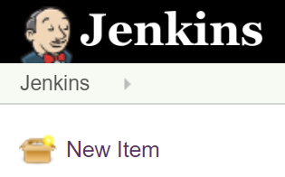
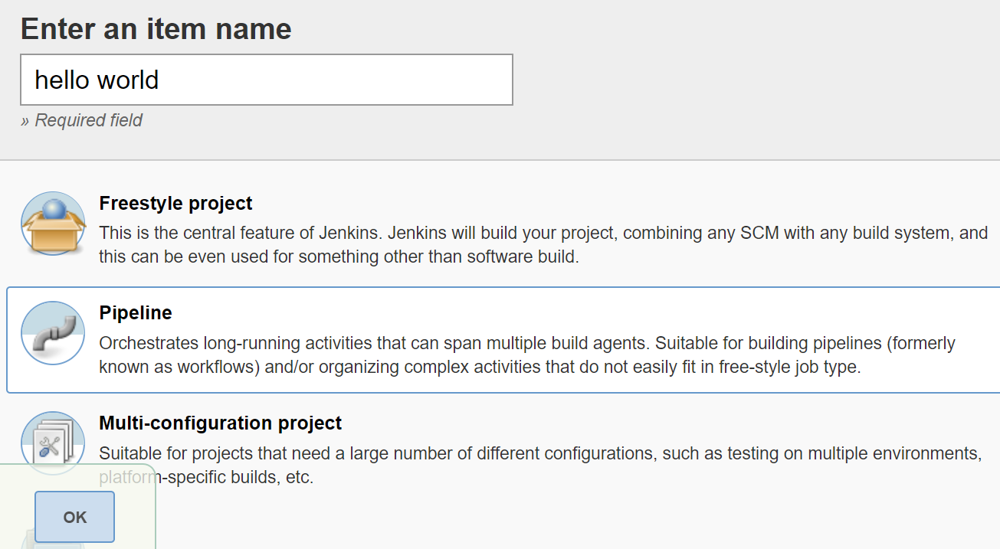
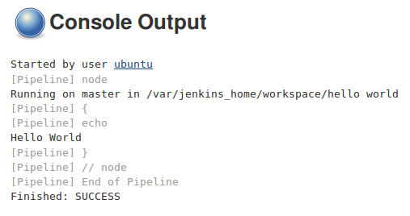

# Jenkins Hello World

전체 IT 세계의 모든 것이 시작됩니다. Hello World 예제를 사용하여 기본이 잘 작동함을 보여줍니다. 이 규칙을 따라 첫 번째 Jenkins 파이프 라인을 생성 해 보겠습니다.

1. 클릭 New Item:


2. **hello world** 항목 이름으로 입력하고 **Pipeline**을 선택한 후 다음을 클릭합니다 **OK**.


3. 많은 옵션이 있습니다. 지금은 건너 뛰고 Pipeline섹션으로 바로 이동합니다.


4. 그런 다음 Script텍스트 상자에 파이프 라인 스크립트를 입력 할 수 있습니다.

```json
pipeline {
     agent any
     stages {
          stage("Hello") {
               steps {
                    echo 'Hello World'
               }
          }
     }
}
```

5. Save를 클릭하십시오 .
6. Build Now 클릭 :


우리는 볼 수 #1세 이하 Build History. 이를 클릭 한 다음을 클릭 Console Output하면 파이프 라인 빌드의 로그가 표시됩니다.




방금 첫 번째 예를 보았고 성공했습니다.출력은 Jenkins가 올바르게 설치되었음을 의미합니다. 이제 가능한 Jenkins 아키텍처를 살펴 보겠습니다.

```
노트
파이프 라인 구문에 대한 자세한 내용은 4 장 , 지속적 통합 파이프 라인에서 설명 합니다.
```